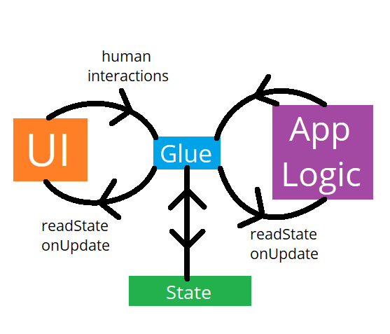

# 💥 synaps 💊


[](https://travis-ci.com/SwadicalRag/synaps)

synaps is simple library that aims to provide tools to create observable class fields with syntactic sugar.

This library was built to work as the backend for a state management library for Flutter.

On its own, synaps does not depend on Flutter and is completely separate from any framework. Its only major dependencies are `build_runner` and `source_gen`

If you want to use this as a state management solution for UIs, perhaps you should look at `synaps_flutter`. It should have
the methods you need, but neatly packed into widgets and helper functions.

## Why?

### Preamble

I like to think that UI is completely separate from application logic (or business logic).
As an example, when a user clicks a button that increments a number, the code to "add one" to 
that number should not reside inside UI code. This code should be separated into its own file, 
as application logic. Obviously in the real world, abstracting something as trivial as addition 
does not make much sense, but if we consider scenarios like "a button that creates a new object",
where this object is depended upon by other sections of the UI, things start to get complicated.

There are countless solutions to this problem: BLoC, Redux, Providers, etc.
Over the course of the last decade, I have personally tried most of the above solutions, and
found it difficult to justify the volume of boilerplate code I was forced to write when
*properly* using these libraries. If I want to increment a number in the application state,
why on earth do I need a **Store**, which contains the number's **State**, which is sent to the UI,
where the UI sends an Increment**Action** to a **Reducer** which can finally update the **Store**.
Wasn't that exhausting to read?

As an independent developer who has other commitments, a demanding full time degree, and who values
self care, I cannot justify spending so much more time writing code that I *know* has the potential
to be written in an intuitive, relatively concise way.

### From first principles

Please humor me for three minutes.
Let's assume that UI code is completely separate from application code, and ask some questions.

> **Q: What do you call UI that has no application logic?**
>
> **A:** A printed piece of paper. On its own, paper can't change its contents.

> **Q: What does UI need to not be a "piece of paper"?**
> 
> **A:** Data. It needs to represent data, and it needs to be able to accept human input to change data.

> **Q: *Where* does UI code get the data it displays?**
>
> **A:** From application logic

> **Q: *When* does UI code get the data it needs to display?**
>
> **A:** When application data changes

> **Q: *Where* does application logic get the input it needs to function?**
>
> **A:** From the UI code.

> **Q: *When* does application logic get the input it needs to function?**
>
> **A:** When a human interaction occurs with the UI.

> **Q: If the UI and Application logic is completely separate, what's missing?**
>
> **A:** A "glue" code that sends changes in application data to the UI, and also sends converts
> human interactions into application data.

> **Q: Doesn't this "glue" stuff sound just like BLoC, Redux, etc.?**
>
> **A:** Exactly. But surely we can make some magical "glue" that is intuitive and easy to use?

> **Q: What makes "glue" intuitive?**
>
> **A:** You shouldn't have to learn a new paradigm to use it, and you shouldn't have to write the same
> code in multiple places. An intuitive "glue" should feel like it isn't even there.

> **Q: How can we link UI and Application logic with "[glue] that isn't even there"?**
> 
> **A:** We can re-use already written code as glue.

> **Q: what?**
> 
> **???:** Let me ask you this: what does a "glue" need anyway?
> 
> **A:** A glue needs to know when UI or application data changes, and it needs to know which parts of
> application logic or UI logic depends upon that bit of data, so that it can update the UI or application
> logic.

> **Q: okay but isn't that what we are specifying with Reducers or State or Actions or whatever**
>
> **A:** Exactly. But why re-write what you have already written?

> **Q: Already written? When? Where? By whom?**
> 
> **A:** By you. When you write UI code, all of the variables you reference ***are*** **in** the code you write.
> When you write application logic, you have *already* specified what the UI can listen to in the form of the
> state that the application *already* uses.

> **Q: Yes, but you can't just magically turn already written code into glue.**
> 
> **A:** But what if you ***can***?



(sorry I know it's mspaint)

### Enter synaps

Synaps is designed to enable "glue" code to record whatever fields you access out of a listenable class, and then use that information to listen to whenever those fields get modified by *any* Dart code.

This means that a pre-written class with a bunch of fields, can be instantly used in UI (with the help of some higher level abstractions e.g. `synaps_flutter`).

## Usage

Coming soon once the API is stable. Until then, if you are truly truly desperate, you can read through the example directories and the codebase, or if you are REALLY REALLY REALLY desperate, I am happy to answer your questions via the issue tracker in this repository.

## Examples

### Flutter

```dart
import 'package:flutter/material.dart';
import 'package:synaps_flutter/synaps_flutter.dart';

// We need this for synaps' generators
part "main.g.dart";

// Define the counter class
@Controller()
class CounterState {
  // Create an observable field for our int counter
  @Observable()
  int counter = 0;
}

class MyHomePage extends StatelessWidget {
  MyHomePage({Key key, this.title}) : super(key: key);

  final String title;

  // Use .ctx() at the end to get an Observable Controller,
  // which internally manages all of Synaps' logic for you.
  final controller = CounterState().ctx();

  // Just use `controller` as you would normally if it were a
  // CounterState.
  void _incrementCounter() {
    controller.counter++;
  }

  void _decrementCounter() {
    controller.counter--;
  }

  void _zeroCounter() {
    controller.counter = 0;
  }

  @override
  Widget build(BuildContext context) {
    return Scaffold(
      appBar: AppBar(
        title: Text(title),
      ),
      body: Center(
        child: Column(
          mainAxisAlignment: MainAxisAlignment.center,
          children: <Widget>[
            Text(
              'You have pushed the button this many times:',
            ),
            // Use Rx() to link Synaps to Flutter
            // and update everything inside this lambda
            // whenver any @Observables that were used
            // inside it changes
            Rx(() => Text(
              '${controller.counter}',
              style: Theme.of(context).textTheme.headline4,
            )),
          ],
        ),
      ),
      floatingActionButton: Row(
        mainAxisSize: MainAxisSize.min,
        children: [
          FloatingActionButton(
            onPressed: _incrementCounter,
            tooltip: 'Increment',
            child: Icon(Icons.add),
          ),
          SizedBox(width: 15),
          FloatingActionButton(
            onPressed: _zeroCounter,
            tooltip: 'Zero',
            child: Icon(Icons.settings_backup_restore),
          ),
          SizedBox(width: 15),
          FloatingActionButton(
            onPressed: _decrementCounter,
            tooltip: 'Decrement',
            child: Icon(Icons.remove),
          ),
        ],
      ),
    );
  }
}

```


### Under the hood

A simple usage example:

`example_controller.dart`
```dart

import "package:synaps/synaps.dart";

part "example_controller.g.dart";

@Controller()
class Counter {
  @Observable()
  int clk = 0;
}

```

`synaps_example.dart`
```dart
import "package:synaps/synaps.dart";

import "example_controller.dart";

void someOtherFunc(Counter counter) {
  counter.clk++;
}

void main() {
  // Basic program that prints the value of a changing int

  final counter = Counter().ctx();

  SynapsMasterController.monitor(
    monitor: () {
      print("Initial value of counter is ${counter.clk}");
    },
    onUpdate: () {
      print("Something inside was updated");
      print("New value of counter is: ${counter.clk}");
    },
  );

  counter.clk++;

  // just to demonstrate for realsies that this works from anywhere
  someOtherFunc(counter);
}

```

(And for the truly interested, here's what's inside `example_controller.g.dart`)

```dart
// GENERATED CODE - DO NOT MODIFY BY HAND

part of 'example_controller.dart';

// **************************************************************************
// ObservableGenerator
// **************************************************************************

class _CounterController extends Counter with ControllerInterface {
  final Counter _internal;
  @override
  int get clk {
    synapsMarkVariableRead(#clk);
    return _internal.clk;
  }

  @override
  set clk(int value) {
    _internal.clk = value;
    synapsMarkVariableDirty(#clk, value);
  }

  _CounterController(this._internal);
}

extension CounterControllerExtension on Counter {
  _CounterController asController() {
    if (this is _CounterController) return this;
    return _CounterController(this);
  }

  _CounterController ctx() => asController();
}
```

## Features and bugs

Please file feature requests and bugs at the issue tracker.
